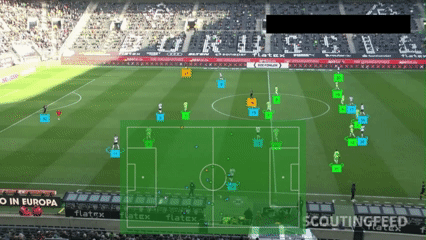
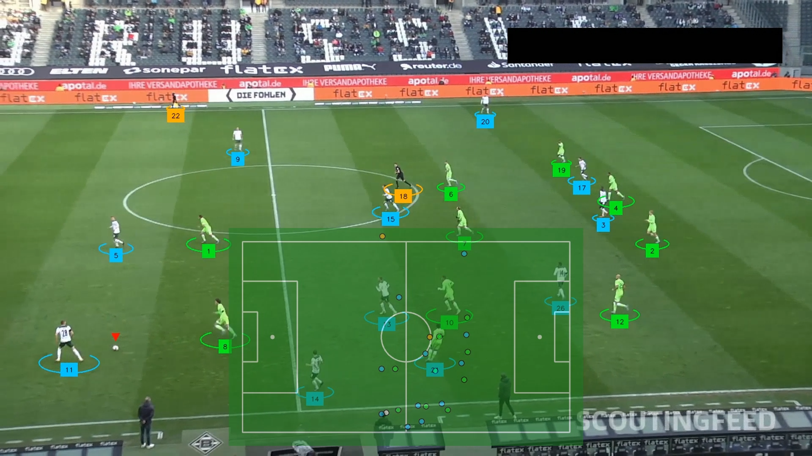

# ⚽ Football Video Analysis

This repository contains tools and scripts for analyzing football (soccer) data, including player performance, team statistics, and advanced metrics. The project aims to provide insightful visualizations, predictive models, and data-driven insights to better understand the game and support data-informed decision-making.


# 🚀 Features

📍 Homography – Map broadcast camera views to a bird’s-eye pitch view.

🧑‍🤝‍🧑 Player Detection & Tracking – Detect and follow players across video frames.

🟢 Ball Tracking – Identify and track ball movement to analyze passes, possession, and shots.

📊 Visualizations – Heatmaps, trajectories, and tactical overlays on match footage.


# Project structure

```
football-vision/
│── team_assigner/           # Logic for assigning detected players to teams
│── utils/                   # Utility functions (image processing, helpers, etc.)
│── annotations.py           # Handle match/video annotations
│── football_AI.ipynb        # Notebook for experimentation and demos
│── generate_analysis.py     # Generate visualizations and analysis outputs
│── inference_yolo.py        # Run YOLO object detection on match videos
│── main.py                  # Entry point script
│── requirements.txt         # Project dependencies
│── transform_perspective.py # Homography and perspective transforms
│── .gitignore               # Git ignore rules
```

# ⚡ Getting Started: Clone the repo
<pre> git clone https://github.com/your-username/football-vision.git </pre>
<pre> cd football-vision </pre>

# Install dependencies
<pre> pip install -r requirements.txt </pre>

# Generate Analysis
After cloning, installing dependencies and going to the directory, run.
``` python main.py ``` # to start generating analysis

**Do not forget to create your .env file which stores your roboflow api key**

# Sample gif


# Sample Image

